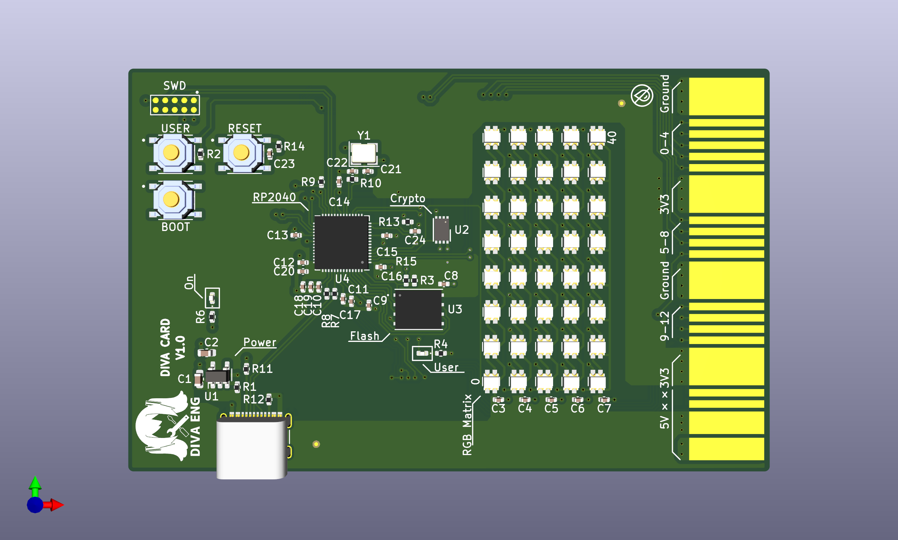

# Diva Card

Raspberry RP2040 based development board/card with builtin LED matrix

## Specs
* RP2040 Dual ARM Cortex-M0+ @ 133MHz
* Microchip ATECC608A crypto processor
* 8*5 WS2812C-2020 RGB LED matrix
* USB-C connector at USB 2.0 speed
* 1 user Button
* 1 user LED
* 13 user IO
* SWD tag connector
* Edge connector for IO/Power
